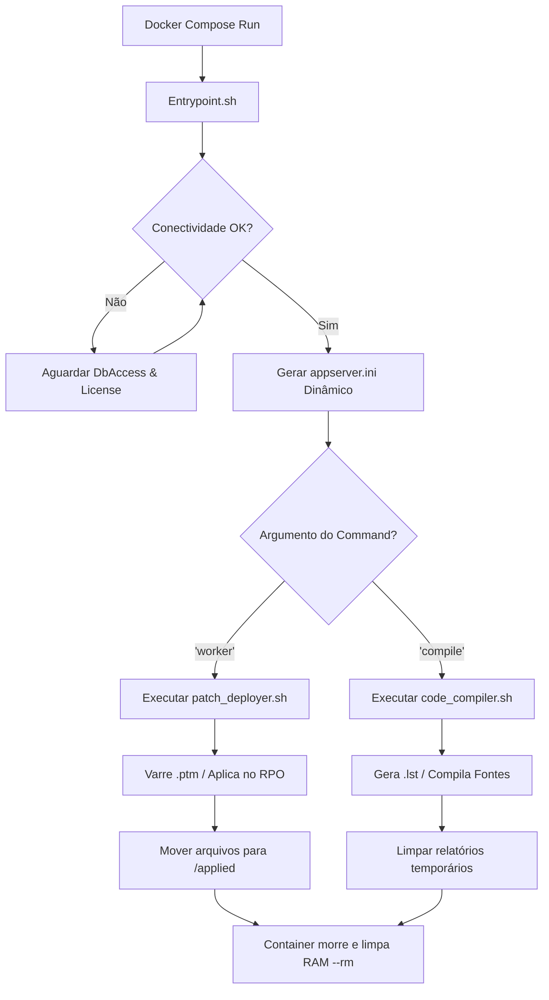

# TOTVS Protheus AppServer - Automated DevOps Worker 🚀

Imagem Docker especialista desenvolvida para atuar de forma efêmera (Job CLI) executando esteiras automatizadas de **Aplicação de Patches** e **Compilação de Fontes** em repositórios do ecossistema Protheus (Sustentando conexões nativas com **MSSQL Server**, **PostgreSQL** e **Oracle**).

## 📊 Fluxo de Orquestração Efêmero (Job Lifecycle)

O diagrama abaixo ilustra o comportamento do container ao ser acionado via linha de comando:



## 🏷️ Rastreabilidade de Build

A tag da imagem publicada permanece fixa entre builds — só muda em uma nova release de versão. Para rastrear qual commit gerou um build específico sem depender da tag, o `pipeline` grava o label `org.opencontainers.image.revision` com o SHA do commit em toda imagem publicada:

```bash
docker inspect --format '{{ index .Config.Labels "org.opencontainers.image.revision" }}' rodrigomicrosiga/appserver-dev-worker:24.3.1.5
```

